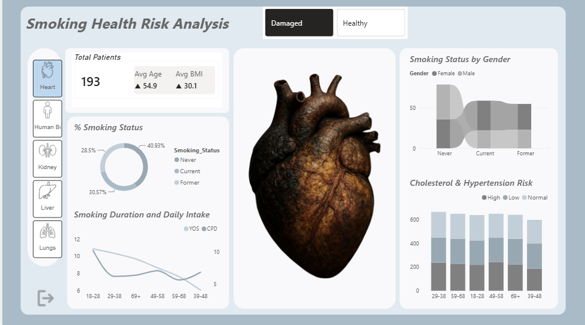
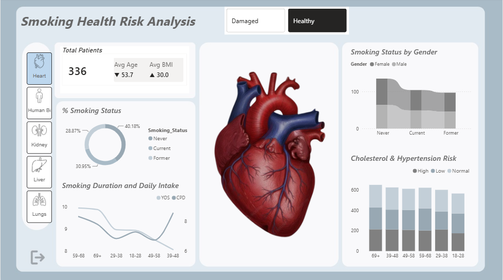
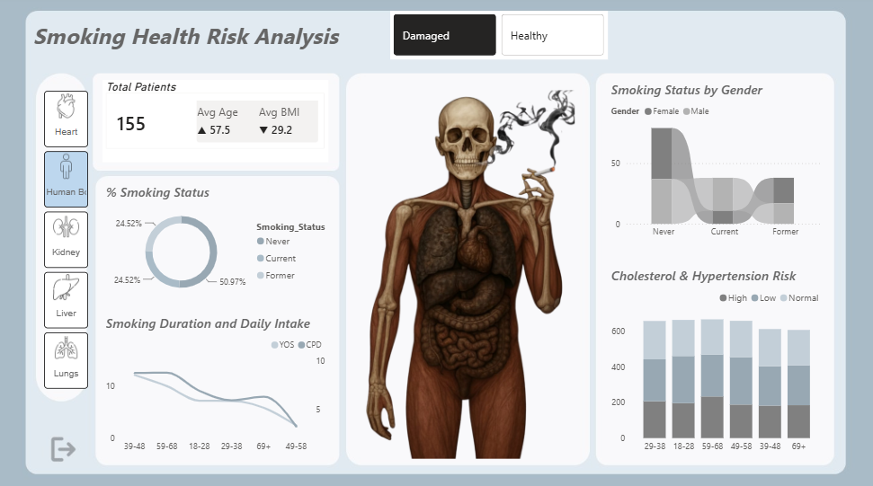

# Smoking Health Risk Analysis
Python + Power BI Project | Images ➝ Data ➝ Insights | Interactive Power BI dashboard analyzing smoking behavior and health risk indicators. 

## Project Overview

This project explores the relationship between smoking habits, lifestyle indicators, and organ health using an interactive Power BI dashboard.

The dashboard compares healthy and damaged organs across multiple categories, including the heart, lungs, liver, kidneys, and overall body health. It also examines factors such as age, BMI, smoking status, cholesterol levels, and hypertension risk to identify patterns that may influence health outcomes.

## Tools & Technologies

* Excel
  
* Power BI

## Dashboard Preview

Dashboard Overview

The dashboard allows users to:

Compare healthy and damaged organ conditions
Analyze smoking status distributions
Explore age and BMI trends
Examine cholesterol and hypertension risk patterns
Filter results by organ type

Organ categories included:

Heart
Lungs
Liver
Kidneys
Overall Body Health

## Key Insights & Findings

The analysis suggests that organ health is influenced by a combination of factors rather than smoking status alone. While smoking remains an important health indicator, the dashboard shows that age, BMI, and other risk factors may also contribute to overall health outcomes. By comparing healthy and damaged organ groups, the dashboard provides a broader view of how different variables interact within the dataset.

## Recommendations

* Continue monitoring smoking behavior alongside other lifestyle and health indicators.
* Consider additional analysis on age-related health trends.
* Expand the dataset to include more health variables for deeper risk assessment.
* Use interactive filtering to investigate specific patient groups and organ conditions.
